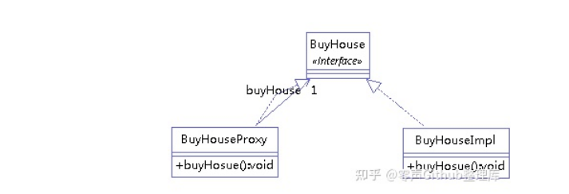

    代理模式给某一个对象提供一个代理对象，并由代理对象控制对源对象的引用
    
    静态代理

    
    动态代理

    
    CGLIB代理

    装饰者模式（Decorator Pattern）和代理模式（Proxy Pattern）都属于结构型设计模式
    它们的目的是在不改变原有代码的情况下扩展或修改已有对象的行为。

    不同之处在于，装饰者模式旨在动态地将责任附加到对象上，而代理模式则是控制对对象的访问。具体来说：

    装饰者模式通过包装一个对象来[增强其功能]，同时保持[接口的一致性]。装饰者模式可以[嵌套使用]，以实现更复杂的功能。
    
    代理模式[控制对对象的访问]，通常是因为原始对象无法满足某些特定要求或安全限制。
    代理模式可以在客户端和原始对象之间添加一个中介层，从而实现更高级别的控制。

    总的来说，装饰者模式用于动态地添加或修改对象的功能，而代理模式用于控制对象的访问。
