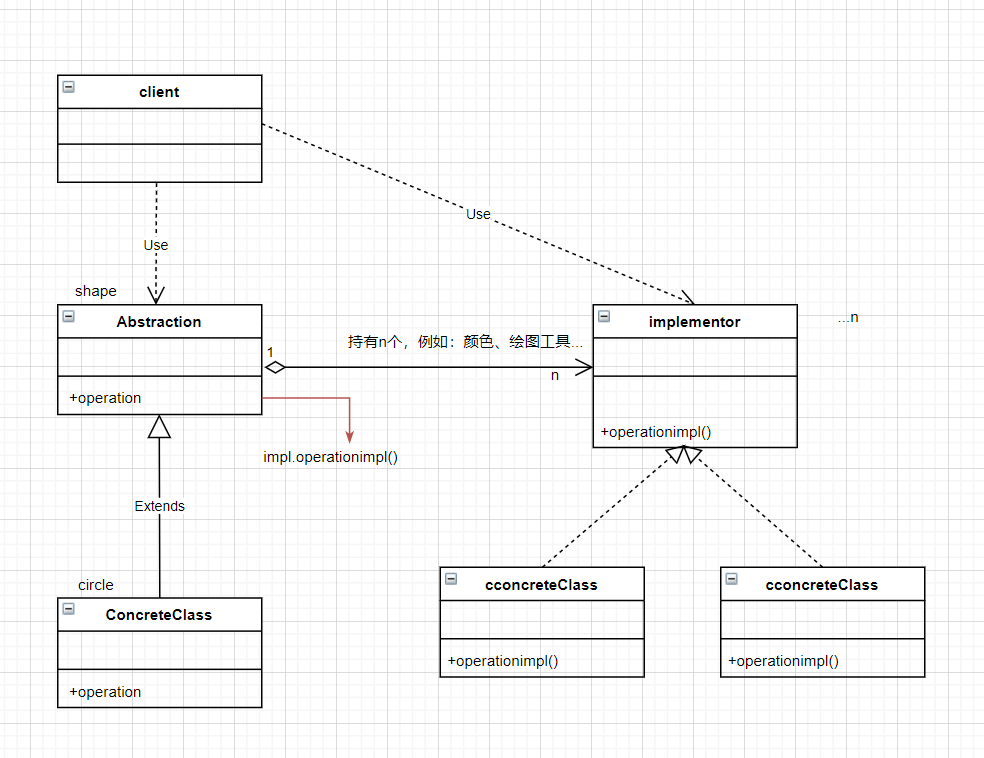

    将抽象化与实现化脱耦，使得二者可以独立的变化，也就是说将他们之间的强关联变成弱关联，
    也就是指在一个软件系统的抽象化和实现化之间使用[组合]/[聚合]关系而[不是继承]关系，从而使两者可以独立的变化。

    桥接模式原理的核心是: 首先有要识别出一个类所具有的[多个独立变化维度],
    将它们设计为两个独立的继承等级结构,为两个维度都提供抽象层,并建立抽象耦合.总结一句话就是: 抽象角色引用实现角色

    桥接模式的优点
    （1）分离抽象和实现部分
    （2）松耦合：多个维度分开
    （3）单一职责原则：每个维度各干各的活

    假设我们有一个画图应用程序，需要支持不同的画图工具和不同的颜色样式。
    通过桥接模式，我们可以将画图工具和颜色样式分别抽象为两个独立的维度，
    并通过桥接关系进行组合，从而可以轻松地扩展和修改这两个维度。

    桥接模式与策略模式：
    策略模式，只有一个维度的变化。
    桥接模式，分离多个维度的变化，提供一个管理类组合这多个维度。

    桥接模式与组合模式：
    组合模式：[整体]-[部分]，场景举例：适需要表示层次结构的系统，如文件系统或图形用户界面。
    桥接模式：[多维度变化]，场景举例：操作系统和应用程序之间的交互
    