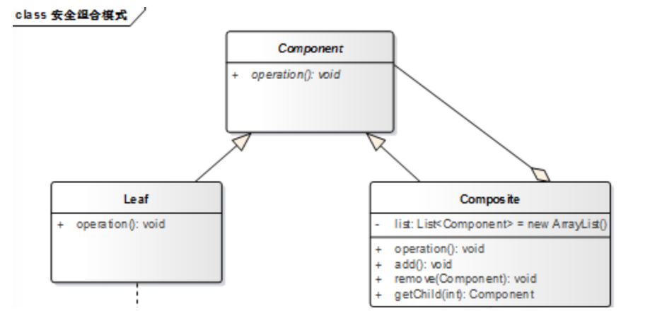

    Mary今天过生日。“我过生日，你要送我一件礼物。”“嗯，好吧，去商店，你自己挑。”“这件T恤挺漂亮，买，这条裙子好看，买，这个包也不错，买。”“喂，买了三件了呀，我只答应送一件礼物的哦。”
    “什么呀，T恤加裙子加包包，正好配成一套呀，小姐，麻烦你包起来。”“……”，MM都会用Composite模式了，你会了没有？
    
    合成模式：合成模式将对象组织到树结构中，可以用来描述整体与部分的关系。合成模式就是一个处理对象的树结构的模式。
    合成模式把[部分]与[整体]的关系用树结构表示出来。合成模式使得客户端把一个个单独的成分对象和由他们复合而成的合成对象同等看待。

