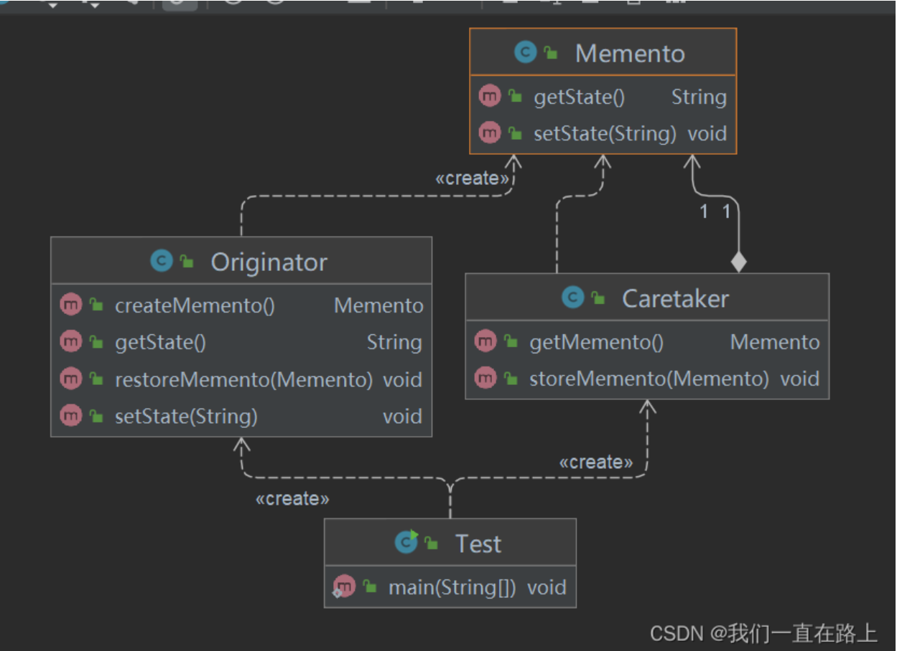

    备忘录模式：保存和恢复对象状态信息的情况

    备忘录模式是一种经典的行为型设计模式，在实际开发中有着广泛的应用。以下是备忘录模式的几个实战应用场景：

    文本编辑器
    文本编辑器通常会提供撤销和恢复操作，这就需要在用户每次进行修改操作时保存当前状态，
    以便在需要恢复时能够快速回到之前的状态。备忘录模式正好可以用来实现这种功能。

    游戏存档
    很多游戏都支持存档，让玩家在需要时可以从之前的进度继续游戏。这也是备忘录模式的一个典型应用场景。
    游戏引擎可以借助备忘录模式来实现快速存储和恢复游戏状态，方便玩家随时暂停和恢复游戏。

    交易系统
    在一些金融交易系统中，买卖双方需要互相确认交易信息，以确保交易的合法性。
    因此，交易系统通常会利用备忘录模式来保存交易信息，并在交易完成后进行核对，防止出现信息错误或篡改的情况。

    操作历史记录
    很多软件都会提供操作历史记录功能，记录用户进行的所有操作，以便于用户查看和回溯。
    这也是备忘录模式的一个典型应用场景。软件可以利用备忘录模式来保存用户操作的历史记录，并在需要时进行恢复。

    总之，备忘录模式在实际开发中有着广泛的应用场景，特别是那些需要记录历史状态或支持撤销和恢复操作的系统中，备忘录模式更是不可或缺的一部分。

