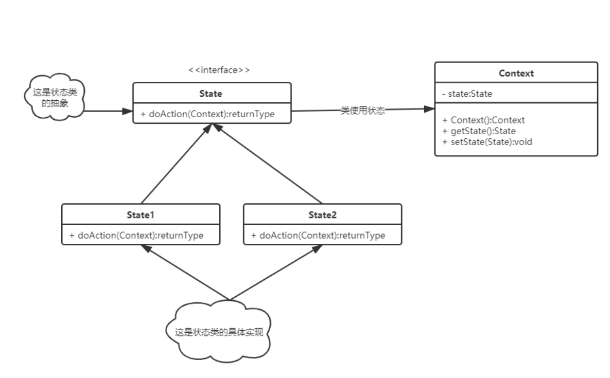

    状态模式是一种行为型设计模式，其目的是允许对象在内部状态发生改变时改变它的行为
    使得对象看起来似乎修改了它的类

    状态模式适用于那些在不同状态下需要执行不同行为的场景。

    例如，一个订单可能会有[多种状态]（已创建、待付款、已完成等），每个状态对应着不同的操作，这时候就可以使用状态模式来实现。

    如果代码中出现了多个条件语句[if/else或switch]，并且这些条件语句会根据对象的状态而改变，也可以使用状态模式进行重构。

    此外，当状态迁移逻辑比较复杂时，例如一个状态只能由特定的一些状态转移而来，或者转移有具体的约束条件，则可以使用[状态模式来简化逻辑]，提高代码可读性和维护性。

    总之，状态模式是一种让对象的[行为随着其内部状态的改变而改变]的设计模式，应用于那些需要根据不同状态执行不同行为的场景。

    策略模式和状态模式的不同：
    状态模式是让一个对象在其内部状态改变时改变它的行为，使得对象看起来似乎修改了它的类。
    而策略模式是定义一组算法，将每个算法都封装起来，并且使它们之间可以互换。