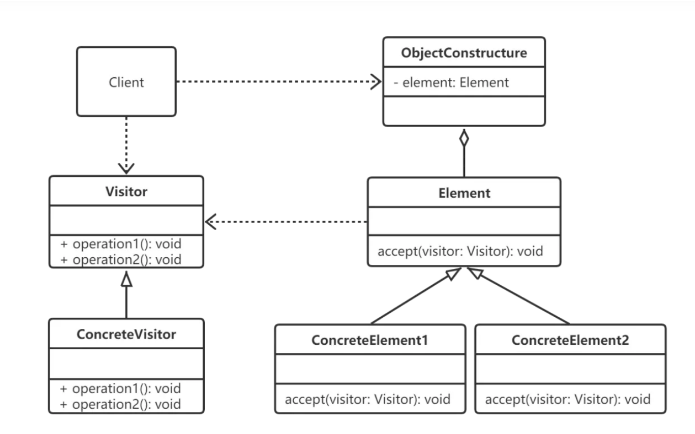

    访问者模式是一种行为型设计模式，它能够将算法与对象结构分离开来，使得同样的算法可以作用于多个不同的对象结构上。

    
    访问者模式的应用场景包括：

    对象结构稳定但是算法经常变化的场景。例如，在一个图书馆管理系统中，图书馆藏书是对象结构，而对于这些藏书的各种操作（如借出、归还、续借、查询等）则是不断更新和变化的算法。

    需要在不同的数据类型上执行相似的操作时。例如，在一个缓存系统中，需要在不同的数据对象（如字符串、数字、图像等）上执行相似的操作（如加密、解密、压缩、解压等）。

    系统中有复杂的对象结构，且不同访问者所需做的操作也不同。例如，在一个电子商务网站中，购物车中的商品是一个复杂的对象结构，而管理员和普通用户在浏览购物车时需要看到的信息不同，因此需要为不同的访问者提供不同的操作方法。

    需要对一组对象进行分析、处理、修改时。例如，在一个编译器中，抽象语法树（AST）是一个复杂的对象结构，对于不同的操作（如语义分析、优化、代码生成等），需要对整个AST进行遍历，并执行不同的操作。

    总之，访问者模式适用于那些需要对一个对象结构中的对象进行多种不同的操作，并且这些操作可以灵活地扩展和修改的场景。如果您在开发中遇到了这样的问题，那么访问者模式就是一个非常好的选择。
