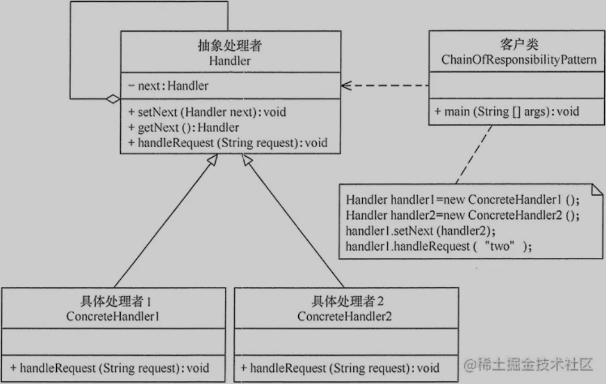

    责任链模式是一种行为型设计模式，它通过将请求沿着处理对象链传递，直到有一个对象处理请求或所有对象都无法处理该请求。
    这样可以避免请求的发送者和接收者之间的耦合，同时也提高了系统的灵活性和可扩展性。

    应用场景：
    
    需要避免请求发送者和接收者之间的耦合性。责任链模式可以将请求的处理对象解耦，使得请求发送者不需要知道请求会被哪个对象处理。
    常见的应用场景包括审批流程、日志记录、异常处理、权限验证等。
    审批流：
        在审批流程中，每个审批者都是一个处理者，如果当前审批者无法处理该请求，则会将该请求转发给下一个审批者，
        直到所有审批者都已处理完毕。这种方式可以使得审批流程更加灵活和可扩展，同时也可以降低代码的耦合度。
    日志记录：
        在日志记录方面，责任链模式可以应用于日志级别的控制。例如，一个系统可能需要记录多个不同级别的日志，如调试信息、警告信息和错误信息。
        我们可以创建一个链，其中每个节点代表一个日志级别，每个节点负责处理相应级别的日志，并将请求转发给链中的下一个节点（即更高级别的节点），
        直到有节点处理该请求为止。这样，我们可以根据需要动态地添加、删除或调整日志级别，使得日志记录更加灵活和可配置。
    异常处理：
        在异常处理方面，可以使用责任链模式来处理异常并进行适当的处理。例如，我们可以创建一个异常处理器链，
        其中每个节点代表一个特定类型的异常处理器，每个节点负责捕获并处理相应类型的异常，
        并将请求转发给链中的下一个节点（即更高级别的节点）。如果当前节点无法处理该异常，
        则将其转发给下一个节点，直到找到能够处理该异常的节点为止。
    权限校验：
        例如，一个Web应用程序可能有以下几个处理器：
        用户认证处理器：检查用户是否已经登录，如果未登录则跳转到登录页面。
        权限验证处理器：检查用户是否有访问该资源的权限，如果没有则提示“无权访问”。
        安全过滤器处理器：检查请求中是否包含恶意内容，如果包含则拒绝访问。
        日志记录处理器：记录请求的时间、IP地址、URI等信息。
        这些处理器可以组成一个责任链

